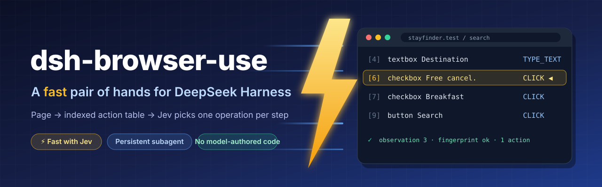
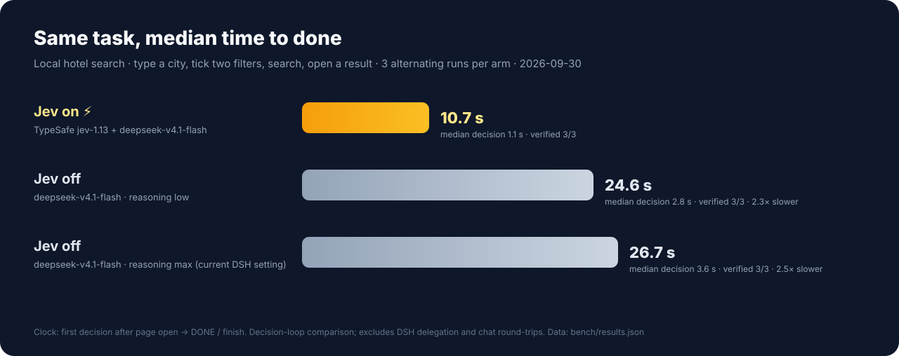
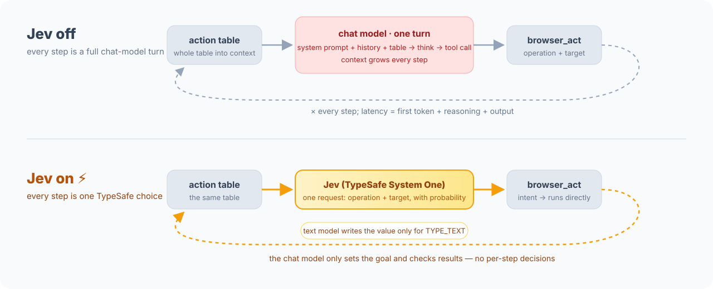

**English** · [中文](README.zh-CN.md)

# @weichen96/dsh-browser-use

> Give **DeepSeek Harness** a browser that can *see and click*: a page is read as an **indexed action-space table**, and the model does exactly one operation on one observed target per step.

This is a **DSH plugin** (a host half + a web half). It contains no browser logic of its own — it hands requests to the [Jev Ultrafast](https://github.com/ricardochen1996/jev-ultrafast) engine (a local checkout or an installed Python package), so there is only **one** loop implementation.

---

## ⚡ The point: speed

The focus is **fast browser decisions**. Jev (TypeSafe System One) picks an operation and target from the current action table; a text model supplies values only when needed for `TYPE_TEXT`. `browser_goal` runs the decision loop inside the engine. `browser_act({ observation, intent })` delegates one decision to Jev, but still returns to its calling agent after each step. Enabling Jev makes these paths available; it does not automatically replace every chat-model turn.



The same local hotel task (type a city, tick two filters, search, open a result), running jev and the "current chat model" in alternating arms, 3 runs each, every run independently verified:

| Mode | How each step is decided | Whole task (median) | Relative |
| --- | --- | --- | --- |
| **Jev on** ⚡ | one jev-1.13 choice | **10.7 s** | baseline |
| Jev off (reasoning low) | a full deepseek-v4.1-flash turn | 24.6 s | **2.3× slower** |
| Jev off (reasoning max, current DSH setting) | a full deepseek-v4.1-flash turn | 26.7 s | **2.5× slower** |

**In this decision-loop benchmark, Jev took about 60% less time than the max-reasoning arm** (26.7 s / 10.7 s ≈ 2.5). Median per-step decision latency was 1.1 s versus 2.8–3.6 s.



> Measured on 2026-09-30: three arms, three completed runs each, all independently verified; one transport failure was recorded and retried. The clock runs from the first decision after page opening to DONE/finish. The script directly loops over the sidecar's intent path versus lean Responses API tool-calling turns using `deepseek-v4.1-flash`, the model configured in DSH at measurement time. This is **not an end-to-end DSH toggle comparison**: it excludes browser startup, initial navigation, post-run verification, DSH delegation and outer chat round-trips. Three runs of one local task do not establish a universal speedup. The Jev text helper uses the same model with thinking disabled; session mode shares routing settings, not necessarily protocol or reasoning settings. See [`bench/`](bench/) for the script and raw data. The benchmark spends model quota and reads credentials only from environment variables.

---

## Repository layout

```text
dsh-browser-use/
├── lib/          Node half: index.js (assembly + delegation) / tools.js (tools & delegate tool) /
│                 sessions.js (browser ownership, attach exclusivity) / sidecar.js (process, cancel, generation) /
│                 engine.js (interpreter & environment probing) / inspector.js + client.js (side panel)
├── bin/          doctor: a one-command self-check after install
├── sidecar/      Python half: bridge.py — the only place that imports the engine
├── test/         Node checks (plugin.mjs / delegation.mjs / inspector.mjs) + Python checks (pytest + two e2e)
├── pyproject.toml / uv.lock   the sidecar's Python environment (engine as a path dependency)
└── package.json  the DSH plugin manifest (dsh.bundle / dsh.client)
```

The engine (`jev_ultrafast`) is **a separate repository**; this project only depends on it and contains none of its code.

## 1. What it provides

**Browser operations are not in the main agent's hands.** The conversation sees only these tools (`browser_task_status` exists only with a persistent subagent):

| Tool | Job |
| --- | --- |
| `browser_task` | Hand a goal to this conversation's **persistent browser subagent**: the first call starts it, and every later call sends the new task to the **same** subagent (it remembers the page and what it did before). The call returns immediately; the conclusion comes back later as a message. `fresh: true` swaps in a new subagent with no memory. |
| `browser_task_status` | What the persistent browser subagent is doing: working (for how long, on which task, on which page) or idle (how its last run ended, its closing message). The conclusion arrives as a message without calling it; `wait: true` blocks until the subagent finishes or messages you, or the user writes (`timeout_ms`, default 2 min, at most 10 min) — only for a step that cannot go on without the result. |
| `browser_doctor` | Self-check: interpreter, engine version, browser, delegation status (including whether this conversation's subagent is working), and a fix command for each missing piece. |

The browser tools live in the **delegated subagent's scope** (6 by default, with `browser_goal` off). Only it can see and call them:

| Tool | Job |
| --- | --- |
| `browser_open` | Open a page in the **browser this Session owns** and return the action-space table. |
| `browser_page` | Re-observe and produce a new observation number. |
| `browser_act` | Run one operation on one target from an observation: `CLICK` / `TYPE_TEXT` / `SELECT` / `SCROLL_UP` / `SCROLL_DOWN` / `WAIT`. With jev on you may instead pass an `intent`: with no `operation`, TypeSafe picks the operation and target on that observation; a `TYPE_TEXT` with no `text` gets its value from the jev text model. |
| `browser_screenshot` | Capture the viewport (image attachment). |
| `browser_console` | Read console messages, page exceptions, failed requests and 4xx/5xx. |
| `browser_goal` | Hand the whole goal to the TypeSafe policy in one run (**off by default**, spends paid quota). |
| `browser_close` | Close the tab, browser and daemon. |

**Keep delegating without opening a pile of `browser_task`s.** The plugin uses DSH's native continuable subagent (`ctx.subagents.startContinuable` / `sendMessage`); each conversation has exactly one browser subagent:

- **New task**: call `browser_task` again — the task is delivered as a message into the same subagent's conversation; if it is busy it is admitted at the next step boundary, if idle it starts right away, and if it was released it cold-starts from persistence (browser tools re-attach automatically).
- **Two-way messaging**: the subagent is granted only the global `send_message`, so it can send you progress, questions and results at any time; you use `send_message` to add to or correct the current task, and `interrupt_agent` to stop it.
- **Results come back on their own**: the subagent sends its conclusion back; when it goes idle DSH also sends the main agent a "Background subagent … finished" notification and wakes it, so no polling. The `browser_task` receipt says so explicitly — keep working or end the turn, never `sleep` in a shell — and, where an agent team is present, that its `wait_agent` / `list_agents` do not see this subagent.
- **Status on request**: `browser_task_status` reads the subagent's state from the host's own `subagent/start` / `subagent/end` events and the agent registry. With `wait: true` it blocks on the same settlement the notification rides on, instead of guessing with `sleep`, and returns early when the user writes or the subagent messages the main agent.
- **Survives restarts**: the subagent is recorded under the tag `browser-task` in the parent session's directory, so after a DSH restart or resume the next `browser_task` / `send_message` finds the same subagent.

When the provider doesn't support continuable subagents (or `delegateMode: one-shot` is set), it falls back to **one-shot delegation**: one subagent per task, and `browser_task` returns after it reports back.

When the composition has no usable subagent provider (or `delegate: false`), the plugin falls back to **direct mode**: the browser tools are mounted on the composition and called from the chat itself — the same implementation, just without a subagent.

Here is what the subagent sees (real output):

```text
Page https://www.baidu.com/ — 百度一下，你就知道
Observation 3. Targets below are valid only for this observation.
[13] textbox 国台办回应鲁比奥涉台言论 — TYPE_TEXT, CLICK
[14] button 百度一下 — CLICK
Without a target: WAIT
```

The side panel also has a **Browser agent** tab: URL, live screenshot, element table, last action — showing the exact page the tools are driving.

---

## 2. Advantages

### 1. Targets come from the observation, not from the model's imagination
The model outputs `(operation, index)`, **never a selector, coordinate or JavaScript**. By contrast, Playwright MCP / Chrome DevTools MCP make the model write its own selectors, which miss or misfire the moment the page changes and cannot be validated ahead of time. Here the index is valid only for "the frame it just read".

### 2. Freshness is a first-class citizen
Every decision is bound to the observation fingerprint: if the page changed, it **refuses to execute and hands back the new table** instead of clicking blindly. Measured on Baidu's homepage: the hot-search list auto-rotates → the first input is intercepted ("Nothing was executed") → re-pick on the new observation → success. **No change is ever auto-retried**, so there are no double clicks or double submits.

### 3. Cheap on tokens
Screenshots are not fed to the model (they're for humans); each step sends only structured text: visible text + element table + the operations available this round.

### 3b. The main agent never reads the page
The table, indices, refusals and re-reads all happen in the subagent's context; the conversation receives only a conclusion. However complex the page, the main agent's context stays the same length — and it has **no** tool that could misclick a page.

### 4. The model doesn't have to guess what's possible
The table lists **the operations and targets allowed on this frame**, including every option of a dropdown (`6:1 → Stay category → Design`). Unsupported operations, occluded controls and disabled fields simply never appear in the table.

### 5. One loop, not two
The browser loop, freshness guards and executor all live in the Python engine, covered by **21 real-browser guard checks + 10 sidecar e2e checks + 92 offline unit tests**; the plugin is a thin adapter (start the sidecar, render the table, forward signals). Fix one place, both sides agree.

### 6. Session-level isolation and reclaim
Each DSH Session gets its own browser (its own profile, debug port and daemon) with serialized operations; everything closes when the Session ends. Parallel sessions never fight over a tab or leak state.

The browser belongs to **the Session that started the task**, not to the subagent: the subagent may be released, restored, or even swapped with `fresh: true`, and the browser, logins and tabs stay. So consecutive `browser_task`s continue on the same page rather than reopening each time. An external browser adopted via `mode: attach` is **held by only one live Session at a time** — a second session is explicitly refused. Two Sessions fighting over one external browser is the only real data risk at this layer.

### 7. It doesn't touch the browser you're using
By default the plugin launches a dedicated Chrome instance. It never touches your personal Chrome profile, so there's no Chrome 144+ "allow remote debugging?" prompt and none of your logins get swept into automation. When you do want to use your own browser, switch explicitly to `mode: attach`:

- **Attach to the Chrome you're using (no `cdpEndpoint`)**: open `chrome://inspect/#remote-debugging` in that Chrome and allow remote debugging; the plugin finds it through the `DevToolsActivePort` Chrome writes into its profile, opens a new tab there to work in, and your logins are available. On macOS this file is privacy-protected, so **the app running DSH needs Full Disk Access** (System Settings → Privacy & Security → Full Disk Access, then restart DSH), otherwise it reports `no_permission` clearly. Each DSH Session's first connection triggers Chrome's one "Allow remote debugging?" prompt; click allow. The plugin only closes tabs it opened and never closes your browser at the end. The engine uses exactly the tab the connection layer built for this run — no extra blank tab — and blank tabs you opened yourself are not closed.
- **Attach to a dedicated debug Chrome (with `cdpEndpoint`)**: `http://127.0.0.1:9333` or `ws://…/devtools/browser/…`, see the config table below.

Each Session uses **its own** profile: if a browser is already running for the same profile, Chrome hands the new launch off to the existing instance and exits (status 0), so the two Sessions share one browser. That's why the plugin partitions by Session; if the host restarts while the browser is still up, the plugin **adopts** that instance (same profile of the same Session) and keeps its logins and tabs rather than starting another.

A launch leaves exactly **one** tab: the browser opens a startup tab, and the connection layer opens a separate tab for this run (named daemons can't share one), which the run drives; once the page is ready the startup tab is closed. Cleanup is conservative — it won't close when only a blank page remains, and it never closes a page the user is reading.

### 8. Debugging is in the tools, not in words
`browser_console` gives console exceptions and failed requests directly; the panel shows the same page live. Observation and action share one state — there is no "what the tool says" vs "the actual page".

### 9. Zero build
The host half is plain ESM; the web half is a hand-written `__ModuleLoader__` script — no tsdown/rollup step. Clone it, `pnpm install` once (only for `@deepseek-ai/schemastery`, used by the Config schema), then edit and restart.

### 10. Capabilities can be turned off
`allowScreenshots`, `jev.enabled` and `reserveBrowserUseSlot` are all config options. Turn off `jev.enabled` to keep decisions with the calling model. The Jev settings are editable under **Sidebar → Plugins → `@weichen96/dsh-browser-use`**; `allowScreenshots` and `reserveBrowserUseSlot` are profile-patch settings.

---

## 3. Install

### From npm

Requires Node.js `^22.19.0 || >=24.0.0`, DSH, Chrome/Chromium, Python 3.12+ and `uv`.

```bash
dsh plugin --profile desktop add @weichen96/dsh-browser-use

# The npm package ships the bridge, not the separate Python engine.
git clone https://github.com/ricardochen1996/jev-ultrafast.git /absolute/path/to/jev-ultrafast
uv sync --project /absolute/path/to/jev-ultrafast
```

Set the engine checkout in the profile's `cordis.patch.yml`, then restart DSH:

```yaml
- id: dsh-browser-use
  config:
    projectPath: /absolute/path/to/jev-ultrafast
```

The plugin uses that checkout's Python environment; npm does not install Chrome or Python dependencies. Use `browser_doctor` in DSH to check the setup. If installing the package into a Node project rather than a DSH profile, use `npm install @weichen96/dsh-browser-use`; this alone does not register it with DSH. Append `@0.2.0` to either command to pin this release.

If migrating from the unpublished local `@rc/dsh-browser-use` package, remove that plugin entry before adding the npm package; do not enable both providers. The internal `id: dsh-browser-use` and configuration keys remain unchanged.

### From a local checkout

This repo holds both the plugin (Node) and its Python half (the sidecar). Clone the engine into the sibling `../jev-ultrafast` first, then:

```bash
# 1. Python environment: install the engine into this repo's own .venv (defaults to the sibling ../jev-ultrafast)
uv sync

# 2. Node dependency: @deepseek-ai/schemastery, used by the Config schema (once)
pnpm install

# 3. The plugin itself: install into a DSH profile
dsh plugin --profile desktop add /absolute/path/to/dsh-browser-use
```

Or install by path from DSH's **Plugins** page. After installing, **restart DSH** (host code is cached in-process; the web bundle loads at startup).

**The name, description and icon on the plugin page** are not written in the plugin code — DSH reads them from package metadata (`packages/boot/app-boot/src/package-meta.ts`), and they **must be resolvable through Node's ESM resolver** — so if those two subpaths are missing from `exports`, the card shows only a bare package name:

| Shown | Source | Fallback |
| --- | --- | --- |
| Title | `meta.title` in `locale/<lang>.json` (`en.json` is the English fallback; add `zh.json` etc. per language) | `package.json.name` |
| Description | `meta.description` from the same | `package.json.description` |
| Icon | the `icon` field in `package.json` (relative path, svg/png/jpeg/webp, ≤256 KiB, inside the package dir), rendered to a data URL | default icon |

```jsonc
// the three things package.json must have
"icon": "icon.svg",
"exports": {
  ".": { "default": "./lib/index.js" },
  "./client": "./lib/client.js",
  "./package.json": "./package.json",     // ← without it, title/description/icon can't be read
  "./locale/*.json": "./locale/*.json"    // ← without it, localized text can't be read
},
"files": ["icon.svg", "locale/*.json", "..."]
```

When the engine checkout isn't a sibling, or you want to reuse its existing virtualenv, add config to the `id: dsh-browser-use` line in the profile's `cordis.patch.yml`:

```yaml
- id: dsh-browser-use
  config:
    projectPath: /absolute/path/to/jev-ultrafast   # where the engine source lives
    # pythonPath: /absolute/path/to/python        # or point directly at an interpreter that already imports jev_ultrafast
```

## 4. The engine (required)

The sidecar (`sidecar/bridge.py`, shipped with this repo) does `import jev_ultrafast` — the upstream engine. The plugin **tries these interpreters in order** and uses the first one that can import the engine:

1. the `pythonPath` config (**if set, only this one** is used; failure won't silently fall through);
2. `<projectPath>/.venv/bin/python` (the engine checkout's own environment);
3. `uv run --project <projectPath>`;
4. this repo's `.venv` (the product of `uv sync`, with the engine installed as a path dependency);
5. `uv run` (this repo);
6. `python3` (must already be able to `import jev_ultrafast`).

`projectPath` is **read only from the plugin config** (not from environment variables). When set, the probe verifies where each interpreter's `jev_ultrafast` is imported from: anything not under `projectPath` is rejected, and the doctor spells out "imports jev_ultrafast from X, not from projectPath Y". When unset, this repo's `.venv` is used (its `pyproject.toml` points at the sibling `../jev-ultrafast`).

### How to confirm "everything is installed"

The plugin itself is pure JavaScript; `pnpm add` only guarantees the **plugin** is installed. The engine is a Python package from another ecosystem that the installer can't bundle or install for it. So the plugin doesn't assume — it **detects**, and says so clearly:

**1. Self-check right after install (one command, exit code usable in scripts)**

```bash
npm run doctor                     # or node bin/doctor.mjs [/path/to/jev-ultrafast] (the arg is projectPath)
```

```text
Engine   : /Users/…/dsh-browser-use/.venv/bin/python (Python 3.12.14, chosen by this package’s virtualenv (uv sync))
           jev_ultrafast 0.1.0 at /Users/…/jev-ultrafast/jev_ultrafast
           browser-harness 0.1.13
Sidecar  : /Users/…/dsh-browser-use/sidecar/bridge.py
Browser  : /Applications/Google Chrome.app/Contents/MacOS/Google Chrome
Status   : ready
```

Whatever's missing gets a command; every candidate interpreter is tried, with each failure listed:

```text
Engine   : not usable — tried 2 interpreter(s)
           /Users/…/dsh-browser-use/.venv/bin/python (this package’s virtualenv (uv sync)): No module named 'jev_ultrafast'
           /usr/bin/python3 (system python3): No module named 'jev_ultrafast'
Problems :
  - … (pythonPath): ModuleNotFoundError: No module named 'jev_ultrafast'
    fix: install the engine: uv sync in /Users/…/dsh-browser-use (or cd ../jev-ultrafast && uv sync)
```

**2. Checked at DSH startup**

The plugin runs the same probe when it loads: if ready, it writes a version line at INFO; if not, it WARNs the full report (with fix commands). A missing engine won't make loading fail and drag the whole profile down.

**3. Checked again before every call**

Any browser tool confirms the engine is usable before starting the sidecar; if it isn't, it **refuses directly with the same diagnostic** rather than throwing a "sidecar exited (1)".

**4. Ask the model any time**

The `browser_doctor` tool returns the same report plus the current Session's browser state, so you can just ask: "check whether the browser environment is ready".

## 5. Configuration

**Change it in the UI (recommended)**: the plugin exports DSH's `Config` schema (`lib/config.js`), and the web half mounts the form in two places, so you don't need to find a config file and changes take effect immediately:

- **Sidebar → Plugins → open `@weichen96/dsh-browser-use`**: the toggles are drawn right above "Included components" (the plugin page's own config area).
- On the same page, **the `dsh-browser-use` row title is itself a "Configure" button** (with a `>` arrow, accessible name `Configure @weichen96/dsh-browser-use`) — it opens the same form.

The form has **only the jev group**, drawn with the shell's own components in the same row layout as other plugins:

| Field in the form | Meaning |
| --- | --- |
| `jev.enabled` | Enable `browser_goal` and `browser_act`'s `intent` (spends TypeSafe and text-model quota) |
| `jev.source` | `session` inherits the main conversation; `custom` uses the URL/key you fill in below |
| `jev.typesafe.baseURL` / `.model` / `.apiKeyEnv` / `.apiKey` | TypeSafe endpoint, model name, key (credential name or plaintext) |
| `jev.textModel.baseURL` / `.model` / `.apiKeyEnv` / `.apiKey` | text-model endpoint, model name, key |

These fields are `.volatile()`: a change takes effect on the spot (the next `browser_goal` or intent-bearing `browser_act` uses the new value); `apiKey` is submitted with `role('secret')` and never appears in any form response, and leaving it blank in the form means "don't touch the stored key".

**All other switches are changed in the profile patch** (after which DSH remounts the plugin, as before): `mode`, `cdpEndpoint`, `executablePath`, `userDataDir`, `headless`, `allowScreenshots`, `requestTimeoutMs`, `delegate`, `delegateMode`, `subagentProvider`, `maxDepth`, `projectPath`, `pythonPath`, `reserveBrowserUseSlot`, `jev.typesafe.fallbackURL`, `jev.textModel.reasoning`, `jev.textModel.headers`. They decide **which tools exist**, which interpreter runs, and whether a composition slot is taken — making them form fields would promise an "immediate effect" that can't be delivered.

One known edge: `jev.enabled` changes the tool set, and the conversation's own tool surface rebuilds immediately; but an already-running persistent browser subagent keeps the tools it was composed with, until it is swapped with `fresh: true` or the plugin is remounted (the `browser_doctor` Jev line always reflects the current config).

After a first pass through the UI, the YAML form below still works (and is the only entry point for fields like `projectPath`):

Write it into the `config:` of the `id: dsh-browser-use` line in the profile's `cordis.patch.yml`:

```yaml
- id: dsh-browser-use
  config:
    projectPath: /absolute/path/to/jev-ultrafast
    jev:
      enabled: true              # enable browser_goal and browser_act's intent; when false nothing is resolved and no key is sent
      source: session            # session: inherit the main conversation; custom: configure it yourself
      typesafe:
        baseURL: https://opencode.ai/zen/v1/systemone
        model: jev-1.13
      textModel:
        reasoning: thinking-disabled
        headers: { x-opencode-session: dsh-harness }
```

**`source: session` (inherit from the main conversation)**: on each `browser_goal` or intent-bearing `browser_act`, it reads the **model route the conversation is currently using** (it follows you when you switch models) — the text model uses that route's `baseURL`, `headers`, model name and key (the DSH credential the provider config's `apiKeyEnv` points at); TypeSafe uses the same key, with its endpoint from `jev.typesafe.baseURL` (the TypeSafe endpoint can't be inferred from a chat route). You can only override `typesafe.baseURL/model/fallbackURL`, `textModel.model` (blank = the main conversation's model), `textModel.reasoning` and appended `textModel.headers`. It refuses with a fix hint when: the route is the Anthropic protocol, has no `baseURL`, uses a login session rather than an API key (e.g. a DeepSeek account login), or the conversation hasn't picked a model yet.

**`source: custom` (configure separately)**:

```yaml
    jev:
      enabled: true
      source: custom
      typesafe:
        baseURL: https://opencode.ai/zen/v1/systemone
        model: jev-1.13
        apiKeyEnv: OPENCODE_GATEWAY_API_KEY   # name of a DSH credential (stored on the Models page) or a DSH env var
      textModel:
        baseURL: https://opencode.ai/zen/go/v1
        model: deepseek-flash
        reasoning: thinking-disabled
        headers: { x-opencode-session: dsh-harness }
        apiKeyEnv: OPENCODE_GATEWAY_API_KEY   # or apiKey: plaintext (not recommended)
```

In both modes, the endpoint and key used by `browser_goal` and `browser_act`'s `intent` come **only from the plugin config / main conversation**: the sidecar does not read the engine checkout's `.env`, and any `TYPESAFE_*` / `TEXT_MODEL_*` in the DSH process environment are cleared before the sidecar starts; the key is passed per request to the sidecar and is visible only during that run. `browser_doctor` shows the jev status and key source (never the key itself). The old `allowGoalMode: true` is still equivalent to `jev.enabled: true`.

| Field | Default | Meaning |
| --- | --- | --- |
| `projectPath` | empty (use this repo's `.venv`) | engine checkout location; once set, only interpreters that import the engine from here are accepted |
| `pythonPath` | auto | pin an interpreter (use this when the engine wheel is installed) |
| `mode` | `launch` | `launch` starts a browser; `attach` connects to a running one |
| `cdpEndpoint` | — | the DevTools address for `attach` (`http(s)://` or `ws(s)://`); blank auto-attaches to the Chrome you use with `chrome://inspect` remote debugging on |
| `executablePath` | system Chrome | which browser to launch |
| `userDataDir` | one per Session (`~/.jev-ultrafast/browser/<session>`) | dedicated profile directory |
| `headless` | `false` | launch without a window |
| `reserveBrowserUseSlot` | `true` | take the `ctx.browserUse` singleton slot (when that service is mounted) |
| `jev.enabled` ✎ | `false` | enable `browser_goal` and `browser_act`'s `intent` (spends TypeSafe and text-model quota); old name `allowGoalMode` |
| `jev.source` ✎ | `session` | `session` inherits the main conversation's route and key; `custom` uses the `baseURL`/key you configure below |
| `jev.typesafe` | engine default | TypeSafe endpoint: `baseURL`, `model`, `fallbackURL`; add `apiKeyEnv` / `apiKey` for `custom`. The form has the first two plus two key fields; `fallbackURL` is YAML-only |
| `jev.textModel` | main conversation / engine default | text model (OpenAI-compatible): `model`, `reasoning` (`none` / `thinking-disabled`), `headers`; add `baseURL`, `apiKeyEnv` / `apiKey` for `custom`. The form has `baseURL` / `model` plus two key fields; `reasoning` / `headers` are YAML-only |
| `allowScreenshots` | `true` | enable `browser_screenshot` |
| `requestTimeoutMs` | `180000` | per-request cap for the sidecar |
| `delegate` | `true` | hand browser operations to a subagent; when `false`, mount them on this conversation (direct mode) |
| `delegateMode` | `persistent` | `persistent`: one persistent browser subagent per conversation, receiving all later tasks; `one-shot`: one subagent per task, returning after it reports. Falls back to `one-shot` automatically when the provider doesn't support continuable subagents |
| `subagentProvider` | `spawn` | the provider name in `ctx.subagents`; it must be able to compose an **in-process** subagent, otherwise it falls back to direct mode |
| `maxDepth` | `0` | delegation-depth cap for the subagent; `0` means use the provider's own recursion budget |

✎ = appears in the form under **Sidebar → Plugins → `@weichen96/dsh-browser-use`** (the package page, or the "Configure" in the row title), with immediate effect (the next time the value is used); fields without ✎ are set only in the profile patch.

## 6. Verify (spends nothing)

```bash
npm run check             # lint, Python units, release metadata + Node checks (real browser, no model calls)
uv run pytest             # offline sidecar protocol and release-gate tests
uv run python test/check_bridge.py   # 10: sidecar end-to-end (stdio + real browser)
uv run python test/check_tabs.py     # 5: a launch leaves exactly one tab
node test/plugin.mjs      # 66: 24 tools & refusals (real browser) + 3 element-state rendering + 4 missing-engine diagnostics + 16 engine config + 2 attach exclusivity + 3 attach-to-your-Chrome + 11 settings form & immediate effect + 3 in-flight cancel
node test/delegation.mjs  # 70: conversation sees only browser_task(+_status), persistent subagent takes later tasks, restores & re-mounts tools after release/restart, status & wait (settle, timeout, user, subagent message, cancel, silent exit), fresh & lost replacement, one-shot delegation, cancel & fallback
node test/inspector.mjs   # 27: web-half registration + config form registration keys/fields/write-back + host routing + page renders
npm run release:check     # npm/Python/uv.lock version and publishing metadata agreement
npm run release:pack      # inspect and install the exact npm tarball; writes dist/ (no publishing)
```

When the engine isn't a sibling directory:

```bash
DSH_BROWSER_USE_PROJECT=/path/to/jev-ultrafast node test/plugin.mjs
```

## 7. Relation to the official `@deepseek-ai/dsh-browser-use`

DSH ships `@deepseek-ai/dsh-browser-use`, which is the **service definition** for "browser capability" (one registration slot only, with no browser operations: no `dsh.bundle`, no `./client`, no registered tools). This project is a **third-party provider implementation**, package name `@weichen96/dsh-browser-use` — a different scope, so the two don't override each other.

The unscoped `dsh-browser-use` on npm is **a different project** (a Browser Use Cloud bridge), unrelated to this plugin; install by scope so you don't get the wrong one.

If that service is mounted in the profile, this plugin takes its single provider slot; enabling it alongside Playwright MCP / Chrome DevTools MCP / Stagehand would conflict, in which case set `reserveBrowserUseSlot` to `false` to load only the tools without taking the slot.

(Measured: the desktop 0.2.0-rc.2 `app.asar` has no browser-use package, and the monorepo doesn't mount it into any composition — so this "slot taking" mostly doesn't happen, and the plugin takes the "no such service in the composition" branch.)

### Alignment with the DSH provider contract

Those upstream 63 lines only define **the slot, the name and ownership**; the contract is written in `docs/subsystems/browser-use.zh.md` and the corresponding decision records. This plugin aligns with it point by point:

| Contract | How |
| --- | --- |
| Single-slot registration, released on unload | `ctx.get('browserUse')?.register('browser-use')`, disposer managed by the effect |
| Stop tools first, then wait for own work, before releasing | effect cleanup order: tools → Session browser → registration slot |
| The browser belongs to an exact live Agent/Session | every call verifies the initiator is still a live agent; resume/fork gets a new browser |
| Attach browser exclusivity | held by one live Session at a time within this provider instance; a second is explicitly refused (2 more checks) |
| Cancellation is one channel before and after launch | request-level `AbortSignal`: in-flight requests settle immediately (kind `cancelled`), delegation winds down with `run.dispose()`; **operations already delivered to the browser are not rolled back** |
| No reuse after a failed cleanup | a generation that failed to close is marked unusable: the next open uses a new process + new daemon name and writes the reason into the tool result |
| Subagent lifecycle belongs to the host | started and continued with `ctx.subagents.startContinuable()` / `sendMessage()` (`start()` in one-shot mode), never building an Agent by hand; `toolFilter` / subagent scope / finish notifications all use host mechanisms, and `browser_task_status` reads the host's `subagent/start` / `subagent/end` events rather than keeping its own clock |
| Tools don't pollute other agents | browser tools are registered in the subagent's scope (not global), and the subagent is `restrict({ allow: ['send_message'] })` (`allow: []` in one-shot mode) to block other global tools |

### The internal identifier is still `dsh-browser-use`

Only the **package name** changed. These are stable anchors for config and UI and don't follow the package name:

- loader-line id: `id: dsh-browser-use` in the profile's `cordis.patch.yml`, where your `config.projectPath` override is attached;
- web half: tab id `dsh-browser-use/inspector`, panel route `/browser-use/`;
- log and error prefix: `dsh-browser-use:`.

**The client module id and plugin form registration keys must use the package name**, now `@weichen96/dsh-browser-use`. The host dispatches `__ModuleLoader__.load({ id })` by the loader line's `name` (the package name); a mismatch shows `bundle … loaded without registering "…"` in the console. The `cordis.patch.yml` bundle row uses the same package name while retaining its internal row id.

## 8. How it works

```text
DSH host (Node)                                        ← this repo's lib/
  dsh-browser-use ── ctx.tools.register(browser_task, browser_task_status, browser_doctor)   the conversation sees only these
                  ── ctx.subagents.startContinuable / sendMessage('spawn') persistent subagent, later tasks go to it
                  │     └─ the subagent's scope: browser_* is registered only here
                  │        the subagent gets only send_message; other global tools are blocked
                  ── ctx.on(subagent/start, subagent/end, agent/inbox/inserted)   the subagent's state, for browser_task_status
                  ── ctx.systemPrompt.section(subagent usage rules)
                  ── ctx.webServer.register('/browser-use')     panel route
                  └─ one sidecar process per Session, serialized operations (reused across delegations)
                         │  stdio JSON lines
                         ▼
  sidecar/bridge.py                                    ← this repo's sidecar/
      ├─ Browser.observe / Browser.act / screenshot / settle   (the engine's existing executor)
      ├─ model.choose / field_text (browser_act with an intent, single step)
      └─ Agent + TypeSafe policy (browser_goal, the whole goal)
                         │  CDP
                         ▼
                   a dedicated Chrome instance (one profile per Session)

engine = jev_ultrafast (a separate repo), imported by the sidecar as a Python dependency.
```

## 9. Limits

- **Install doesn't guarantee the engine exists**: installing the plugin ≠ installing the engine, which is why it detects (see section 4). It also won't install Python dependencies for you — that's the user's environment, and the command is handed to you (`uv sync`).
- Depends on the Python engine; when the engine is unavailable, the browser tools refuse with a fix command (`browser_doctor` is always available).
- The `browserUse` slot is exclusive (only when that service is mounted).
- Changing the plugin code requires a **DSH restart** to take effect.
- No `browser_eval` / coordinate input — turning model output into code would break this project's first principle.
- Page state doesn't survive Session recovery: resume/fork opens a new browser (as the DSH provider contract requires).
- `browser_goal` and intent-bearing `browser_act` spend TypeSafe and text-model quota, which DSH's usage stats don't see.
- **Delegation needs a subagent provider in the composition** (e.g. `@deepseek-ai/dsh-subagent-spawn-in-process` that can compose in-process subagents). Without one it falls back to direct mode: a WARN in the log, and the `browser_doctor` `Delegation:` line explains why. The standard DSH base bundle mounts `spawn` by default; if the provider appears **after** the plugin loads, a DSH restart is needed to enter delegation mode.
- The subagent is restricted to the browser tools plus `send_message` (other global tools are blocked by the allow list): it can click pages and message the main agent, but can't touch your files or shell.
- The persistent subagent's context accumulates across tasks; when it grows too long or drifts, swap it with `browser_task({ fresh: true, … })` (the old one is interrupted, the browser kept). In one-shot mode the subagent is released when its task ends.

## 10. Uninstall

```bash
dsh plugin --profile desktop remove @weichen96/dsh-browser-use
```

## 11. CI and releases

[`ci.yml`](https://github.com/ricardochen1996/dsh-browser-use/blob/main/.github/workflows/ci.yml) runs on pull requests and pushes to `main`. It tests Node 22.19.0 and 24.21.0 with Python 3.12 on Ubuntu 24.04, using the runner's Chrome. Actions, package-manager versions and the external engine commit are pinned; pnpm and uv install from their lockfiles. The checks include lint, unit tests, real-browser integration, matching npm/Python versions, generated chart consistency, and an isolated install of the actual npm tarball. No model credentials are needed. Update the engine SHA in this workflow deliberately when adopting engine changes.

[`release.yml`](https://github.com/ricardochen1996/dsh-browser-use/blob/main/.github/workflows/release.yml) runs on annotated `vX.Y.Z` tags whose commits are reachable from `main`. It reruns CI and publishes **the exact tarball CI tested**, then creates a GitHub Release with generated notes and the tarball attached. Only stable releases are supported; prerelease tags are refused rather than accidentally published as `latest`. Reruns skip npm publication only when the existing version's integrity matches; different bytes for the same version fail. New releases cannot move `latest` backwards.

### One-time trusted publishing setup

In the npm package's **Settings → Trusted publishing**, add a GitHub Actions publisher:

| Setting | Value |
| --- | --- |
| Organization or user | `ricardochen1996` |
| Repository | `dsh-browser-use` |
| Workflow filename | `release.yml` |
| Environment | `npm` |

The publisher must be allowed to publish. The terminal equivalent needs account 2FA, and `--allow-publish` is off unless passed:

```bash
npx npm@11.20.0 trust github @weichen96/dsh-browser-use --file release.yml \
  --repo ricardochen1996/dsh-browser-use --env npm --allow-publish
```

If no publisher with publish permission matches this workflow, the publish step fails with `E404 Not Found - PUT` and nothing is published. Fix the setting, then use **Re-run failed jobs** on the same run.

In GitHub, create the **`npm` environment** and allow version-tag deployments. Required-reviewer approval is recommended. Keep the publisher's environment name identical to the workflow. The publishing job alone receives `id-token: write` and `contents: write`; CI stays read-only. npm OIDC generates short-lived credentials and provenance, so no `NPM_TOKEN` secret is required. These account settings must be configured by a package/repository administrator before the first automated release.

### Cut the next version

Start from a clean, up-to-date `main` checkout with the engine installed. Keep all three version records together:

```bash
npm version 0.2.1 --no-git-tag-version
uv version 0.2.1 --no-sync
npm run check
npm run test:e2e
npm run release:pack

git add package.json pyproject.toml uv.lock
git commit -m "chore(release): v0.2.1"
git tag -a v0.2.1 -m "v0.2.1"
git push --atomic origin main v0.2.1
```

Inspect the Release workflow before announcing the release. To retry a failed run, use **Re-run jobs**, or `gh workflow run release.yml --ref v0.2.1`; dispatching on a branch is rejected. Never move a published tag or reuse a published version.

`v0.1.0` records the source of the already-published npm package and predates these workflows. Pushing that tag does **not** run the new workflow, and it must not be moved to the CI commit. After pushing `main` and `v0.1.0`, its GitHub release can be backfilled without republishing npm:

```bash
gh release create v0.1.0 --verify-tag --generate-notes --title v0.1.0
```

---

Engine: [Jev Ultrafast](https://github.com/ricardochen1996/jev-ultrafast) (forked from [browser-use/jev-ultrafast](https://github.com/browser-use/jev-ultrafast), MIT) · browser access: [Browser Harness](https://github.com/browser-use/browser-harness) · plugin host: [DeepSeek Harness](https://github.com/deepseek-harness)
