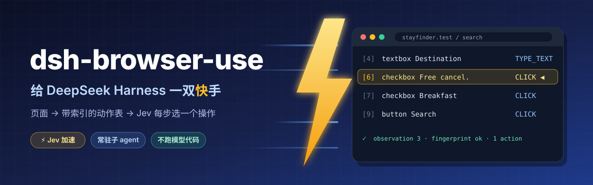
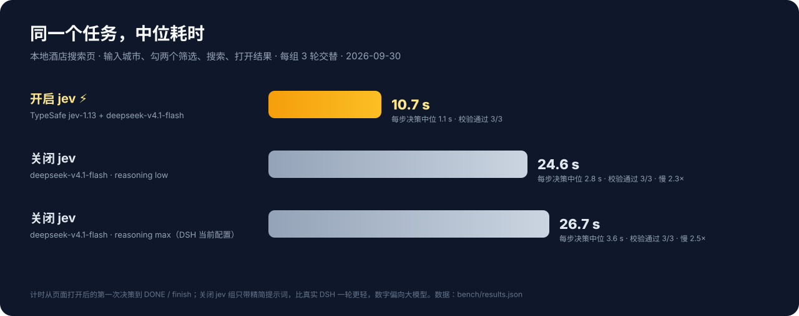
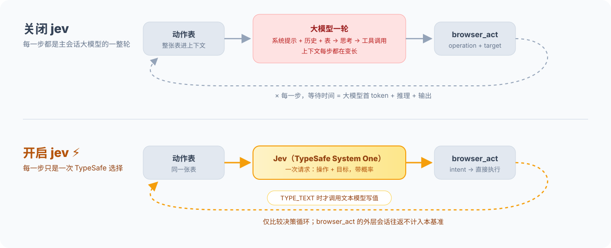

[English](README.md) · **中文**

# @weichen96/dsh-browser-use

> 给 **DeepSeek Harness** 装上"能看、能点"的浏览器：页面被读成一张**带索引的动作空间表**，模型每步只做一个操作、只对一个观测到的目标。

这是一个 **DSH 插件**（host 半 + Web 端半），本身不含浏览器逻辑——它把请求交给 [Jev Ultrafast](https://github.com/ricardochen1996/jev-ultrafast) 引擎执行，因此只有**一份**循环实现。引擎以固定版本的 wheel 随 npm 包一起发布，插件第一次加载时把它装进自己的 Python 环境：用机器上已有的 Python 3.12+（DSH 自带一个），机器上确实没有时才用 [uv](https://docs.astral.sh/uv/)。不用克隆引擎，不手动配 Python，也不需要预先安装任何工具。

---

## ⚡ 亮点：快

亮点是**更快的浏览器决策**。Jev（TypeSafe System One）从当前动作表中选出操作与目标，只有 `TYPE_TEXT` 需要生成输入值时才调用文本模型。`browser_goal` 在引擎内完成整段决策循环；`browser_act({ observation, intent })` 则只把当前一步的决策交给 Jev，完成后仍返回调用它的 agent。打开 Jev 开关只是开放这些路径，不会自动替代所有大模型轮次。



同一个本地酒店任务（输入城市、勾两个筛选、搜索、打开结果），jev 与"当前大模型"交替各跑 3 轮、每轮结果独立校验：

| 模式 | 每步怎么决策 | 整段任务（中位） | 相对 |
| --- | --- | --- | --- |
| **开启 jev** ⚡ | jev-1.13 一次选择 | **10.7 s** | 基准 |
| 关闭 jev（reasoning low） | deepseek-v4.1-flash 一整轮 | 24.6 s | **慢 2.3×** |
| 关闭 jev（reasoning max，DSH 当前配置） | deepseek-v4.1-flash 一整轮 | 26.7 s | **慢 2.5×** |

**在这次决策循环基准中，Jev 比 max 思考组少用约 60% 的时间**（26.7 s / 10.7 s ≈ 2.5），每步决策的中位延迟为 1.1 s，对照组为 2.8–3.6 s。



> 测量日期为 2026-09-30：三组各完成 3 轮，全部通过独立校验；另记录了 1 次网络失败并重跑。计时从页面打开后的第一次决策到 DONE/finish。脚本直接循环调用 sidecar 的 intent 路径，对照组用精简提示词通过 Responses API 逐轮调用工具，模型是测量时 DSH 配置的 `deepseek-v4.1-flash`。这**不是 DSH 内切换开关的端到端对比**：不计浏览器启动、初始导航、结束后的独立校验、DSH 委派与外层会话往返。一个本地任务的三轮数据不代表普遍加速倍率。Jev 文本助手使用同名模型但关闭思考；session 模式共享路由配置，不代表协议和思考设置完全相同。脚本与原始数据见 [`bench/`](bench/)；测速会消耗模型额度，凭据只从环境变量读取。

---

## 仓库结构

```text
dsh-browser-use/
├── lib/          Node 半：index.js（装配 + 委派）/ tools.js（工具与委派工具）/
│                 sessions.js（浏览器所有权、attach 独占）/ sidecar.js（进程、取消、代次）/
│                 engine.js（解释器与环境探测）/ provision.js + python.js（安装引擎）/
│                 inspector.js + client.js（右侧栏面板）
├── bin/          doctor（自检，--install 安装）/ vendor_engine.py（重建并核对随包引擎）/
│                 vendor_requirements.py（生成并核对 vendor/requirements.txt）/ 发版检查
├── sidecar/      Python 半：bridge.py —— 唯一 import 引擎的地方
├── vendor/       插件要安装的引擎 wheel、pip 按哈希安装的 requirements.txt，
│                 以及 jev-ultrafast.json（wheel 由引擎哪个 revision 构建）
├── test/         Node 检查（plugin.mjs / delegation.mjs / inspector.mjs / provision.mjs）+ Python 检查（pytest + 两个 e2e）
├── pyproject.toml / uv.lock   sidecar 的 Python 环境（引擎取自 vendor/ 里的 wheel）
└── package.json  DSH 插件清单（dsh.bundle / dsh.client）
```

引擎（`jev_ultrafast`）是**另一个独立仓库**。本包只带一个由它某个固定 revision 构建的 wheel（`vendor/`，revision 记在 `vendor/jev-ultrafast.json`），不含它的源码。

## 一、它提供什么

**浏览器操作不在主 agent 手里。** 对话里只有这几个工具（`browser_task_status` 只在常驻子 agent 模式下存在）：

| 工具 | 作用 |
| --- | --- |
| `browser_task` | 把一个目标交给本对话的**常驻浏览器子 agent**：第一次调用启动它，之后每次调用都把新任务发给**同一个**子 agent（它记得页面和之前做过什么）。调用立即返回，结论稍后以消息形式回到对话。`fresh: true` 换一个没有记忆的新子 agent |
| `browser_task_status` | 常驻浏览器子 agent 在干什么：工作中（干了多久、哪个任务、在哪个页面），或空闲（上一轮怎么结束的、收尾消息）。不调它结论也会以消息形式自动送达；`wait: true` 会阻塞到子 agent 完成或给你发消息、或用户发话为止（`timeout_ms` 默认 2 分钟，最多 10 分钟）——只在离了结果就没法往下走时用 |
| `browser_doctor` | 自检：解释器、引擎版本、引擎安装进度、浏览器、委派状态（含本对话的子 agent 是否在工作）、以及每一项缺失的修复命令。`install: true` 立即安装引擎，或重试一次失败的安装 |

浏览器工具挂在**被委派的子 agent 的 scope** 里（默认 6 个，`browser_goal` 关闭时）。只有它看得见、只有它能调用：

| 工具 | 作用 |
| --- | --- |
| `browser_open` | 在**本 Session 独占的浏览器**里打开页面，返回动作空间表 |
| `browser_page` | 重新观测，给出新的观测编号 |
| `browser_act` | 对某个观测里的某个目标执行一次操作：`CLICK` / `TYPE_TEXT` / `SELECT` / `SCROLL_UP` / `SCROLL_DOWN` / `WAIT`。开启 jev 后可改传 `intent`：不给 `operation` 时由 TypeSafe 在这个观测上选出操作与目标；`TYPE_TEXT` 不给 `text` 时由 jev 文本模型写入值 |
| `browser_screenshot` | 截取可视区域（图片附件） |
| `browser_console` | 读取控制台消息、页面异常、失败请求与 4xx/5xx |
| `browser_goal` | 把整个目标交给 TypeSafe 策略一次跑完（**默认关闭**，会消耗付费额度） |
| `browser_close` | 关掉标签页、浏览器与 daemon |

**持续派活，不用开一堆 `browser_task`。** 插件用 DSH 原生的 continuable subagent（`ctx.subagents.startContinuable` / `sendMessage`），每个对话只有一个浏览器子 agent：

- **派新任务**：再调一次 `browser_task`，任务作为消息送进同一个子 agent 的会话；它正在忙就在下一步边界插入，空闲就直接开工，已被释放就从持久化里冷启动恢复（浏览器工具自动重新挂上）。
- **双向通信**：子 agent 只额外放开了全局的 `send_message`，可以随时给主 agent 发进度、提问、交结果；主 agent 用 `send_message` 给它补充/纠正当前任务，用 `interrupt_agent` 叫停。
- **结果自动回来**：子 agent 干完会把结论发回来；它空闲下来时 DSH 还会给主 agent 发一条"Background subagent … finished"的通知并唤醒它，不用轮询。`browser_task` 的回执会把这点说清楚——继续干别的或结束本轮，不要在 shell 里 `sleep`；组合里有 agent team 时还会注明它的 `wait_agent` / `list_agents` 看不到这个子 agent。
- **随时查状态**：`browser_task_status` 从宿主自己的 `subagent/start` / `subagent/end` 事件和 agent 注册表读出子 agent 的状态。`wait: true` 等的是通知所依据的同一次结算，而不是靠 `sleep` 去猜；用户发话或子 agent 给主 agent 发消息时会提前返回。
- **重启也找得回**：子 agent 用标签 `browser-task` 记在父会话的目录里，DSH 重启或 resume 后，下一次 `browser_task` / `send_message` 会找回同一个子 agent。

provider 不支持 continuable（或配置 `delegateMode: one-shot`）时，退回**一次性委派**：每个任务一个子 agent，`browser_task` 等它回报后再返回。

组合里没有可用的 subagent provider 时（或 `delegate: false`），插件退回**直接模式**：浏览器工具挂到组合上，对话框里自己调用——同一份实现，只是不经过子 agent。

子 agent 看到的东西长这样（真实输出）：

```text
Page https://www.baidu.com/ — 百度一下，你就知道
Observation 3. Targets below are valid only for this observation.
[13] textbox 国台办回应鲁比奥涉台言论 — TYPE_TEXT, CLICK
[14] button 百度一下 — CLICK
Without a target: WAIT
```

右侧栏还有一个 **Browser agent** 标签页：地址、实时截图、元素表、最后一个动作，看的就是工具正在操作的那个页面。

---

## 二、优势

### 1. 目标来自观测，不是模型编出来的
模型输出的是 `(操作, 索引)`，**永远不是 selector、坐标或 JavaScript**。对照之下，Playwright MCP / Chrome DevTools MCP 这类方案要让模型自己写选择器，页面一改就点错、点空，而且无法事先验证。这里的索引只对"它刚读到的那一帧"有效。

### 2. 新鲜度是一等公民
每个决定都绑定在观测指纹上：页面变了，**拒绝执行并把新表交回来**，而不是硬点。实测百度首页：热榜自动轮换 → 第一次输入被拦下（"Nothing was executed"）→ 用新观测重选 → 成功。**任何变更都不会被自动重试**，所以不会出现"点两次""提交两遍"。

### 3. Token 便宜
不把截图喂给模型（截图只给人看），每步只送结构化文本：可见文本 + 元素表 + 本轮可选操作。

### 3b. 主 agent 不读页面
表格、索引、拒绝与重读都发生在子 agent 的上下文里，对话只收到一段结论。页面有多复杂，主 agent 的上下文就还是那么长；它也**没有**能点错页面的工具。

### 4. 模型不用猜能做什么
表里直接列出**这一帧允许的操作与目标**，包括下拉框的每一个可选项（`6:1 → Stay category → Design`）。不支持的操作、被遮挡的控件、被禁用的字段根本不会出现在表里。

### 5. 一条循环，不是两套
浏览器循环、新鲜度护栏、执行器都在 Python 引擎里，由 **21 项真实浏览器 guard 检查 + 10 项 sidecar 端到端检查 + 92 项离线单测**覆盖；插件只是薄适配层（启动 sidecar、渲染表格、转发信号）。改一处，两边一致。

### 6. Session 级隔离与回收
每个 DSH Session 一个独立浏览器（独立 profile、独立调试端口、独立 daemon），操作串行；Session 结束自动全关。多个会话并行不会互抢标签页，也不会串状态。

浏览器属于**发起任务的那个 Session**，不属于子 agent：子 agent 被释放、恢复甚至用 `fresh: true` 换掉，浏览器、登录态和标签页都留下。所以连续几个 `browser_task` 是接着同一个页面继续，而不是每次重开。`mode: attach` 接来的外部浏览器**一次只留给一个 live Session**，另一个会话会被明确拒绝——两个 Session 抢同一个外部浏览器，是这层里唯一真正的数据风险。

### 7. 不碰你正在用的浏览器
插件默认自起一个专用 Chrome 实例。它不碰你个人 Chrome 的 profile，所以不会出现 Chrome 144+ 那个"允许远程调试"的授权弹窗，更不会把你的登录态卷进自动化。需要接自己的浏览器时，显式切到 `mode: attach`：

- **接你正在用的 Chrome（不填 `cdpEndpoint`）**：在那个 Chrome 里打开 `chrome://inspect/#remote-debugging`，允许远程调试；插件通过 Chrome 写在 profile 里的 `DevToolsActivePort` 自动找到它，在里面新开一个标签页干活，登录态直接可用。macOS 下这个文件受隐私保护，**运行 DSH 的 App 需要"完全磁盘访问权限"**（系统设置 → 隐私与安全性 → 完全磁盘访问权限，授权后重启 DSH），否则会明确报 `no_permission`。每个 DSH Session 第一次连接时 Chrome 会弹一次"允许远程调试？"，点允许即可；插件只关自己开的标签页，结束时不会关你的浏览器。引擎直接用连接层为本次运行建好的那个标签页，不会再额外开空白页；你自己打开的空白新标签页也不会被关。
- **接一个专用的调试 Chrome（填 `cdpEndpoint`）**：`http://127.0.0.1:9333` 或 `ws://…/devtools/browser/…`，见下方配置表。

每个 Session 用**自己的** profile：同一个 profile 如果已有浏览器在跑，Chrome 会把新启动"交接"给旧实例并直接退出（status 0），两个 Session 就会共用一个浏览器。因此插件按 Session 分目录；若宿主重启而浏览器还在，插件会**接管**那个实例（同一个 Session 的同一份 profile），继续用它的登录态与标签页，而不是再起一个。

一次启动只留**一个**标签页：浏览器自己会开一个启动标签页，连接层又会给这次运行一个独立标签页（命名 daemon 之间不能共用一个），运行驱动后者；页面就绪后，启动标签页会被关掉。收尾是保守的——浏览器里只剩空白页时不关，用户正在读的页面永远不关。

### 8. 调试能力在工具里，不在嘴上
`browser_console` 直接给控制台异常与失败请求；面板实时显示同一页面。观察和操作共享同一份状态，不存在"工具说的"和"实际页面"两套事实。

### 9. 零构建
host 半是普通 ESM，Web 半是手写的 `__ModuleLoader__` 脚本，没有 tsdown/rollup 步骤；克隆下来 `pnpm install` 一次（只为 `@deepseek-ai/schemastery`，Config schema 用），之后改完重启即可。

### 10. 能力可关
`allowScreenshots`、`jev.enabled`、`reserveBrowserUseSlot` 都是配置项。关闭 `jev.enabled` 即由调用方模型继续决策；Jev 设置可在**侧边栏「插件」→ `@weichen96/dsh-browser-use`** 的配置区里修改，`allowScreenshots` 和 `reserveBrowserUseSlot` 则在 profile patch 中配置。

---

## 三、安装

### 从 npm 安装

需要 Node.js `^22.19.0 || >=24.0.0`、DSH 和 Chrome/Chromium。**其余都不用你自己装。** DSH 为自家的文档工具带了一个 Python 3.12 运行时，插件就用它构建环境；也可以用机器上任何其他 Python 3.12+；两者都没有时才用 [`uv`](https://docs.astral.sh/uv/getting-started/installation/)。

```bash
dsh plugin --profile desktop add @weichen96/dsh-browser-use
```

重启 DSH。插件第一次加载时，会把随包的引擎装进它自己的环境（`<plugin>/.venv`）：先用找到的 Python 建一个 virtualenv，再用 `pip` 安装 `vendor/requirements.txt`——sidecar 的运行时依赖，版本和每个产物的哈希都取自 `uv.lock`——最后从磁盘装上随包的引擎 wheel。第一次安装只下载约 **1.3 MB** 的 wheel，几秒钟完成；机器上确实没有 Python 3.12+ 时才退回 `uv sync --frozen`，那条路会额外下载约 25 MB 的 Python 3.12。日志会写明安装何时开始、引擎何时就绪；安装进行中时浏览器工具会等它完成，`browser_doctor` 能看到装到哪一步。之后每次加载只检查引擎能否 import。每个插件版本有各自的环境，所以升级后会重新安装一次。需要代理时，在 DSH 运行的环境里设置 `HTTPS_PROXY`。

想提前装好、或在失败后重试：让模型调用 `browser_doctor` 并带上 `install: true`，或在已安装的包里运行 doctor：

```bash
node /path/to/node_modules/@weichen96/dsh-browser-use/bin/doctor.mjs --install
```

安装不放在 npm 的 `postinstall` 脚本里：DSH 安装插件时生命周期脚本默认被拦下，所以由插件在加载时自己装。npm 不会安装 Chrome。如果只是安装到 Node 项目而不是 DSH profile，可用 `npm install @weichen96/dsh-browser-use`；这个命令本身不会把插件注册到 DSH。需要固定版本时，在上述包名后追加 `@0.4.0`。

如果之前安装了未发布的本地 `@rc/dsh-browser-use`，请先移除旧插件条目再安装 npm 包，不要同时启用两个 provider。内部 `id: dsh-browser-use` 和配置字段保持不变。profile 里仍把 `projectPath` 设为引擎 checkout 的，会继续用那个 checkout；删掉它就改用随包的引擎。

### 从本地 checkout 安装

这个仓库里同时有插件（Node）和它的 Python 半（sidecar）：

```bash
# ① Python 环境：本仓库自己的 .venv，含随包引擎 wheel 与开发工具
uv sync

# ② Node 依赖：Config schema 用的 @deepseek-ai/schemastery（装一次即可）
pnpm install

# ③ 插件本体：装进 DSH profile
dsh plugin --profile desktop add /absolute/path/to/dsh-browser-use
```

或在 DSH 的 **Plugins** 页面里按路径安装。安装后**重启 DSH**（host 代码在进程内会被缓存，Web 端 bundle 在启动时装载）。测试另外还要驱动一个引擎 checkout：把它克隆到同级 `../jev-ultrafast`（或设置 `DSH_BROWSER_USE_PROJECT`），切到 `vendor/jev-ultrafast.json` 记录的 revision，并在里面 `uv sync`。

**插件页上的名字、描述和图标**不是插件代码里写的，而是 DSH 从包元数据读的（`packages/boot/app-boot/src/package-meta.ts`），并且**必须能通过 Node 的 ESM 解析器解析到**——所以 `exports` 里少了这两个子路径，卡片上就只剩一个裸包名：

| 显示 | 来源 | 回退 |
| --- | --- | --- |
| 标题 | `locale/<lang>.json` 的 `meta.title`（`en.json` 是英文回退，`zh.json` 等按语言加） | `package.json.name` |
| 描述 | 同上的 `meta.description` | `package.json.description` |
| 图标 | `package.json` 的 `icon` 字段（相对路径，svg/png/jpeg/webp，≤256 KiB，须在包目录内），渲染成 data URL | 默认图标 |

```jsonc
// package.json 里必须有的三处
"icon": "icon.svg",
"exports": {
  ".": { "default": "./lib/index.js" },
  "./client": "./lib/client.js",
  "./package.json": "./package.json",     // ← 少了它，标题/描述/图标全都读不到
  "./locale/*.json": "./locale/*.json"    // ← 少了它，本地化文案读不到
},
"files": ["icon.svg", "locale/*.json", "..."]
```

想用随包引擎以外的引擎（你正在改的 checkout，或一个已经装好引擎的解释器）时，在 profile 的 `cordis.patch.yml` 里给 `id: dsh-browser-use` 那一行加配置。设置其中任何一项，插件就不再自己安装（见第四节）：

```yaml
- id: dsh-browser-use
  config:
    projectPath: /absolute/path/to/jev-ultrafast   # 引擎 checkout：用它的 .venv（在里面 uv sync），或在里面 uv run
    # pythonPath: /absolute/path/to/python        # 或直接指定一个已经能 import jev_ultrafast 的解释器
```

## 四、引擎

sidecar（`sidecar/bridge.py`，随本包一起走）`import jev_ultrafast`，也就是上游那个引擎。本包以 wheel 的形式带着它（`vendor/jev_ultrafast-<version>-py3-none-any.whl`，由 `vendor/jev-ultrafast.json` 记录的 revision 构建），`uv.lock` 按哈希锁定这个 wheel 和全部依赖。插件按顺序**逐个试**下面这些解释器，用第一个能导入引擎的：

1. `pythonPath` 配置（**指定了就只用它**，失败不会偷偷换别的）；
2. `<projectPath>/.venv/bin/python`（引擎 checkout 自己的环境）；
3. `uv run --project <projectPath>`；
4. 本包自己的环境 `<plugin>/.venv`，由插件自己构建。

系统里碰巧有的 `python3` 不会被当作 sidecar 的解释器：在没装开发者工具的 Mac 上，它会弹出安装对话框，而不是回答；而且插件自己构建的环境才是它能够复现的那个。

**`pythonPath` 和 `projectPath` 都没设时，环境归插件自己管**，并按机器上最省事的方式构建：

**1. 机器上已经有 Python 3.12+——不用 uv，也不下载解释器。** 插件按顺序查看：DSH 应用自带的 Python 运行时、DSH 装在自己主目录下的那份（`~/.dsh/dsh-runtimes/*/dependencies/python`）、uv 管理的解释器、Homebrew、pyenv，以及 `PATH`；每个候选都会先探测（版本、`venv`、`ensurepip`）再使用，macOS 上跳过 `/usr/bin/python3`。然后执行：

```bash
<python> -m venv [--clear] <plugin>/.venv
<plugin>/.venv/bin/python -m pip install --require-hashes --no-deps --only-binary=:all: \
  --index-url <PyPI 或 PIP_INDEX_URL> -r <plugin>/vendor/requirements.txt
<plugin>/.venv/bin/python -m pip install --no-index --no-deps <plugin>/vendor/<engine wheel>
```

`vendor/requirements.txt` 由 `bin/vendor_requirements.py` 从 `uv.lock` 生成（两者不一致时 CI 直接失败），所以 `--require-hashes` 提供的保证和 `--frozen` 一样：装的就是 lock 记录的那些产物，一字节不差。前两条命令共下载约 1.3 MB。可以用 `DSH_BROWSER_USE_PYTHON` 指定解释器路径，用 `PIP_INDEX_URL` 走镜像而不是 PyPI。

**2. 机器上没有 Python 3.12+ 时用 uv。** 同一份 lock，构建出同一个环境：

```bash
UV_PROJECT_ENVIRONMENT=<plugin>/.venv \
  uv sync --frozen --no-dev --no-install-project --inexact --no-install-package pillow --python 3.12 --project <plugin>
```

uv 先在 `PATH` 里找，再去它的安装器和 Homebrew 放的位置找（`~/.local/bin`、`~/.cargo/bin`、`/opt/homebrew/bin`、`/usr/local/bin` 等），因为从 Dock 启动的 DSH 的 `PATH` 很短；`UV` 环境变量可以精确指定。

两种情况都在这些时机安装：DSH 加载插件时、浏览器调用之前，或被要求时（`browser_doctor` 带 `install: true`、`node <plugin>/bin/doctor.mjs --install`）。同一时间只跑一次安装：期间到来的浏览器调用会等它完成。失败后一分钟内的调用直接拿到同一份诊断、不重新尝试，`install: true` 则立即重试。既没有 Python 3.12+ 也没有 uv 时，报错会给出安装其中之一的命令；doctor 会逐条列出试过的解释器以及被跳过的原因。

**pillow 是故意不装的。** Browser Harness 声明它，是为了自己的截图标注和视频辅助函数；本插件只 import `browser_harness._ipc`、`admin`、`helpers` 和 `daemon`，截图直接走 CDP 拿 JPEG，引擎也以 `screenshots=False` 运行——这些路径都不会碰 PIL。省掉它，第一次安装就从 5.8 MB 降到 1.3 MB。想装回来：在 checkout 里 `uv sync --frozen`，或往 `<plugin>/.venv` 里 `pip install pillow==12.3.0`。

**设置了其中任何一项，插件就不安装**：那个解释器或 checkout 归你管，doctor 会给出要执行的命令（`cd <projectPath> && uv sync`，或 `uv pip install --python <pythonPath> <plugin>/vendor/<wheel>`）。`projectPath` **只从插件配置读**（不看环境变量）。配置了它时，探测会核对每个解释器导入的 `jev_ultrafast` 到底来自哪里：不在 `projectPath` 之下的一律不用，doctor 会写明"imports jev_ultrafast from X, not from projectPath Y"。

### 装完怎么确认"都装好了"

添加插件只是把引擎的 wheel 和 lock 里的依赖清单放到了磁盘上；把它们装进 Python 需要一个解释器（或 uv）和网络，发生在加载时。所以插件不假设、而是**检测**，并把结果说清楚：

**① 自检（一条命令，退出码可用在脚本里）**

```bash
node <plugin>/bin/doctor.mjs             # 只检查
node <plugin>/bin/doctor.mjs --install   # 缺引擎就先安装（或重试），再检查
npm run doctor                           # 在 checkout 里同样用法；路径参数即 projectPath
```

`browser_doctor` 和启动日志里会打印真实的 `<plugin>` 路径。刚 `dsh plugin add` 完、DSH 还没加载插件时：

```text
Engine   : not usable — tried 1 interpreter(s)
           <plugin>/.venv/bin/python (this package’s environment): not installed yet
Sidecar  : <plugin>/sidecar/bridge.py
Browser  : /Applications/Google Chrome.app/Contents/MacOS/Google Chrome
Project  : (unset)
Problems :
  - the browser engine is not installed yet in <plugin>/.venv
    fix: the next browser call installs it; to install it now: browser_doctor with install: true, or node <plugin>/bin/doctor.mjs --install
```

带 `--install` 时，先输出安装器自己的日志，然后是：

```text
Engine   : <plugin>/.venv/bin/python (Python 3.12.14, chosen by this package’s environment)
           jev_ultrafast 0.1.0 at <plugin>/.venv/lib/python3.12/site-packages/jev_ultrafast
           browser-harness 0.1.13
Install  : installed into <plugin>/.venv with pip (Python 3.12.14) in 7s; pillow is skipped (this plugin never calls the helpers that use it)
Sidecar  : <plugin>/sidecar/bridge.py
Browser  : /Applications/Google Chrome.app/Contents/MacOS/Google Chrome
Project  : (unset)
Status   : ready
```

安装失败时，会写出安装器报告的原因和针对该原因的修复：网络不通 → `HTTPS_PROXY`；索引里没有锁定的版本、或索引给的是另一个产物 → `PIP_INDEX_URL`；uv 拿不到 Python → `uv python install 3.12` 或 `UV_PYTHON_INSTALL_MIRROR`；包目录只读 → 让它可写，或设置 `pythonPath`。试过的每个候选解释器都会逐条列出各自的失败原因；既没有 Python 3.12+ 也没有 uv 时，修复里两种办法都会给出。

**② DSH 启动时就检查**

插件加载时会跑同一个探测：就绪就往日志 INFO 写一行版本；缺引擎且环境归插件自己管时，记一行"正在安装"并在后台开始安装（之后写版本行，或 WARN 输出整份报告）；其他情况 WARN 输出整份报告（含修复命令）。不会因为缺引擎就加载失败、把整个 profile 拖下水。

**③ 调用前再兜一次**

任何浏览器工具在启动 sidecar 之前都会确认引擎可用；环境归插件自己管时，会加入正在进行的安装或发起安装。仍不可用就**直接拒绝并附上同一份诊断**，而不是抛一个"sidecar exited (1)"。

**④ 随时问模型**

`browser_doctor` 工具返回同一份报告 + 当前 Session 的浏览器状态，可以直接问："看看浏览器环境好了没"。

## 五、配置

**在界面里改（推荐）**：插件导出了 DSH 的 `Config` schema（`lib/config.js`），Web 半又把表单挂在了两个位置，所以不用找配置文件、改完即刻生效：

- **侧边栏「插件」→ 打开 `@weichen96/dsh-browser-use`**：开关直接画在「包含的组件」上面（插件页自身的配置区）。
- 同一页里 **`dsh-browser-use` 那一行的标题本身就是「配置」按钮**（带 `>` 箭头，无障碍名 `配置 @weichen96/dsh-browser-use`），点开是同一套表单。

表单里**只有 jev 这一组**，用 shell 自己的组件画成和其它插件一样的行式布局：

| 表单里的字段 | 说明 |
| --- | --- |
| `jev.enabled` | 开放 `browser_goal` 与 `browser_act` 的 `intent`（花 TypeSafe 与文本模型额度） |
| `jev.source` | `session` 继承主会话；`custom` 才用下面自己填的 URL/key |
| `jev.typesafe.baseURL` / `.model` / `.apiKeyEnv` / `.apiKey` | TypeSafe 端点、模型名、key（凭据名或明文） |
| `jev.textModel.baseURL` / `.model` / `.apiKeyEnv` / `.apiKey` | 文本模型端点、模型名、key |

这些字段是 `.volatile()` 的：改完当场生效（下次 `browser_goal` 或带 `intent` 的 `browser_act` 就用新值），`apiKey` 以 `role('secret')` 提交、不出现在任何表单响应里，表单里留空就表示不动已存的 key。

**其余开关都在 profile patch 里改**（改完 DSH 会重挂插件，和以前一样）：`mode`、`cdpEndpoint`、`executablePath`、`userDataDir`、`headless`、`allowScreenshots`、`requestTimeoutMs`、`delegate`、`delegateMode`、`subagentProvider`、`maxDepth`、`projectPath`、`pythonPath`、`reserveBrowserUseSlot`、`jev.typesafe.fallbackURL`、`jev.textModel.reasoning`、`jev.textModel.headers`。它们决定**有哪些工具**、跑哪个解释器、占不占组合槽位——做成表单字段等于承诺一个做不到的"立即生效"。

一个已知边界：`jev.enabled` 改的是工具集合，对话自己的工具面会立刻重建；但一个已经存在的常驻浏览器子 agent 保留它被组合时那套工具，直到它被 `fresh: true` 换掉或插件被重挂（`browser_doctor` 的 Jev 行始终反映当前配置）。

改完一次之后，下面的 YAML 写法仍然有效（也是 `projectPath` 这类字段唯一的入口）：

写入 profile 的 `cordis.patch.yml` 中 `id: dsh-browser-use` 那一行的 `config:`：

```yaml
- id: dsh-browser-use
  config:
    # projectPath: /absolute/path/to/jev-ultrafast   # 只在想用引擎 checkout 代替随包引擎时设置
    jev:
      enabled: true              # 开放 browser_goal 与 browser_act 的 intent；false 时不解析、也不传任何 key
      source: session            # session：继承主会话；custom：自己配
      typesafe:
        baseURL: https://opencode.ai/zen/v1/systemone
        model: jev-1.13
      textModel:
        reasoning: thinking-disabled
        headers: { x-opencode-session: dsh-harness }
```

**`source: session`（从主会话继承）**：每次调用 `browser_goal` 或带 `intent` 的 `browser_act` 时读取**当前对话正在用的模型路由**（切了模型也跟着变）——文本模型用该路由的 `baseURL`、`headers`、模型名和 key（该 provider 配置里 `apiKeyEnv` 指向的 DSH 凭据）；TypeSafe 用同一个 key，端点取 `jev.typesafe.baseURL`（TypeSafe 端点无法从聊天路由推出来）。可覆盖的只有 `typesafe.baseURL/model/fallbackURL`、`textModel.model`（留空 = 主会话的模型）、`textModel.reasoning` 和追加的 `textModel.headers`。以下情况会拒绝并给出修复提示：路由是 Anthropic 协议、没有 `baseURL`、用登录态而非 API key（如 DeepSeek 账号登录）、对话还没选模型。

**`source: custom`（单独配置）**：

```yaml
    jev:
      enabled: true
      source: custom
      typesafe:
        baseURL: https://opencode.ai/zen/v1/systemone
        model: jev-1.13
        apiKeyEnv: OPENCODE_GATEWAY_API_KEY   # DSH 凭据（Models 页存的）或 DSH 环境变量的名字
      textModel:
        baseURL: https://opencode.ai/zen/go/v1
        model: deepseek-flash
        reasoning: thinking-disabled
        headers: { x-opencode-session: dsh-harness }
        apiKeyEnv: OPENCODE_GATEWAY_API_KEY   # 或 apiKey: 明文（不推荐）
```

两种模式下，`browser_goal` 与 `browser_act` 的 `intent` 所用的端点和 key **只来自插件配置/主会话**：sidecar 不读引擎 checkout 的 `.env`，DSH 进程环境里的 `TYPESAFE_*` / `TEXT_MODEL_*` 会在启动 sidecar 前被清掉；key 按次随请求传给 sidecar，只在那次运行期间可见。`browser_doctor` 显示 jev 状态和 key 来源（不显示 key 本身）。旧的 `allowGoalMode: true` 仍等价于 `jev.enabled: true`。

| 字段 | 默认 | 含义 |
| --- | --- | --- |
| `projectPath` | 空（用随包引擎，装在本包的 `.venv`，自动安装） | 改用的引擎 checkout；设置后只接受从这里导入引擎的解释器，插件也不再安装任何东西 |
| `pythonPath` | 自动 | 指定一个已经能 import `jev_ultrafast` 的解释器；设置后只试它，插件也不再安装任何东西 |
| `mode` | `launch` | `launch` 自起浏览器；`attach` 接已在运行的浏览器 |
| `cdpEndpoint` | — | `attach` 模式的 DevTools 地址（`http(s)://` 或 `ws(s)://`）；留空则自动接你正在用、开了 `chrome://inspect` 远程调试的 Chrome |
| `executablePath` | 系统 Chrome | 启动哪个浏览器 |
| `userDataDir` | 每 Session 一个（`~/.jev-ultrafast/browser/<session>`） | 专用 profile 目录 |
| `headless` | `false` | 无窗口启动 |
| `reserveBrowserUseSlot` | `true` | 占用 `ctx.browserUse` 单例槽（该服务被挂载时） |
| `jev.enabled` ✎ | `false` | 开放 `browser_goal` 与 `browser_act` 的 `intent`（花 TypeSafe 与文本模型额度）；旧名 `allowGoalMode` |
| `jev.source` ✎ | `session` | `session` 继承主会话的路由和 key；`custom` 用下面自己配的 `baseURL` / key |
| `jev.typesafe` | 引擎默认 | TypeSafe 端点：`baseURL`、`model`、`fallbackURL`；`custom` 时再加 `apiKeyEnv` / `apiKey`。表单里有前两项与两个 key 字段，`fallbackURL` 只在 YAML 里 |
| `jev.textModel` | 主会话 / 引擎默认 | 文本模型（OpenAI 兼容）：`model`、`reasoning`（`none` / `thinking-disabled`）、`headers`；`custom` 时再加 `baseURL`、`apiKeyEnv` / `apiKey`。表单里有 `baseURL` / `model` 与两个 key 字段，`reasoning` / `headers` 只在 YAML 里 |
| `allowScreenshots` | `true` | 开放 `browser_screenshot` |
| `requestTimeoutMs` | `180000` | 单次 sidecar 请求上限 |
| `delegate` | `true` | 浏览器操作交给子 agent；`false` 时挂给本对话（直接模式） |
| `delegateMode` | `persistent` | `persistent`：每个对话一个常驻浏览器子 agent，后续任务都发给它；`one-shot`：每个任务一个子 agent、等回报再返回。provider 不支持 continuable 时自动用 `one-shot` |
| `subagentProvider` | `spawn` | `ctx.subagents` 里的 provider 名；需要它能组合**进程内**子 agent，否则退回直接模式 |
| `maxDepth` | `0` | 子 agent 的委派深度上限；`0` 表示用 provider 自己的递归预算 |

✎ = 出现在**侧边栏「插件」→ `@weichen96/dsh-browser-use`**（包页面或行标题里的「配置」）的表单里，改完立即生效（在下次用到该值时）；没有 ✎ 的字段只在 profile patch 里配。

## 六、验证（不花一分钱）

```bash
npm run check             # lint、Python 单测、发版元数据 + Node 检查（真浏览器，无模型调用）
uv run pytest             # sidecar 协议与发版门禁单测（离线）
uv run python test/check_bridge.py   # 10 项：sidecar 端到端（stdio + 真浏览器）
uv run python test/check_tabs.py     # 5 项：一次启动只留一个标签页
node test/plugin.mjs      # 66 项：24 工具与拒绝（真浏览器）+ 3 元素状态渲染 + 4 缺引擎诊断 + 16 引擎配置 + 2 attach 独占 + 3 接你的 Chrome + 11 设置页表单与即时生效 + 3 在途取消
node test/delegation.mjs  # 70 项：对话只见 browser_task(+_status)、常驻子 agent 接收后续任务、释放/重启后恢复并重新挂工具、状态与等待（结算、超时、用户发话、子 agent 来信、取消、静默退出）、fresh 与丢失替换、一次性委派、取消与回退
node test/inspector.mjs   # 27 项：Web 端注册 + 配置表单的注册键/字段/写回 + host 路由 + 页面可渲染
node test/provision.mjs   # 93 项：14 uv 查找与失败诊断 + 24 安装（同时只跑一次、失败→修复、重试窗口、没有 uv、超时）+ 23 Python 路径（探测、venv、按哈希 pip、wheel、索引、回退）+ 21 经引擎检查的安装与报告 + 4 取消等待 + 7 doctor 工具与命令行（假 uv 与假 python，不下载）
npm run release:check     # 核对 npm/Python/uv.lock 版本、发布元数据、随包引擎（wheel、清单、lock 哈希）与 vendor/requirements.txt 一致
npm run release:pack      # 检查并独立安装实际 npm 包，让它自己构建引擎环境，输出到 dist/，不会发布
```

Node 检查驱动的是引擎 checkout，而不是随包的 wheel。checkout 不在同级 `../jev-ultrafast` 时：

```bash
DSH_BROWSER_USE_PROJECT=/path/to/jev-ultrafast node test/plugin.mjs
```

## 七、与官方 `@deepseek-ai/dsh-browser-use` 的关系

DSH 自带 `@deepseek-ai/dsh-browser-use`，那是"浏览器能力"的**服务定义**（只有一个注册槽，不含任何浏览器操作：没有 `dsh.bundle`、没有 `./client`、不注册工具）。本项目是**第三方 provider 实现**，包名 `@weichen96/dsh-browser-use`——scope 不同，两者不会互相覆盖。

npm 上未 scoped 的 `dsh-browser-use` 属于**另一个项目**（Browser Use Cloud 的桥接包），与本插件无关；按名安装时认 scope，别装错。

如果 profile 里挂载了那个服务，本插件会占用它唯一的 provider 槽；与 Playwright MCP / Chrome DevTools MCP / Stagehand 同时启用会冲突，此时把 `reserveBrowserUseSlot` 设为 `false` 即可只加载工具、不占槽。

（实测：桌面端 0.2.0-rc.2 的 `app.asar` 里没有任何 browser-use 包，monorepo 也没有把它挂进任何 composition——所以这条"占槽"多数情况下不会发生，插件走的是"组合里没有该服务"的分支。）

### 与 DSH provider 契约的对齐

上游那 63 行只定义**槽、名字和所有权**，契约写在 `docs/subsystems/browser-use.zh.md` 与对应的决策记录里。本插件逐条对齐：

| 契约 | 做法 |
| --- | --- |
| 单槽注册，卸载时释放 | `ctx.get('browserUse')?.register('browser-use')`，disposer 由 effect 管理 |
| 释放前先停工具、再等自有工作结束 | effect 的清理顺序：工具 → Session 浏览器 → 注册槽 |
| 浏览器属于确切的 live Agent/Session | 每次调用都核对发起者仍是 live agent；resume/fork 是新的浏览器 |
| 附加浏览器独占 | 该 provider 实例内一次只留给一个 live Session，第二个被明确拒绝（另有 2 项检查） |
| 取消是启动前后统一的通道 | 请求级 `AbortSignal`：在途请求立即结算（kind `cancelled`），委派与 `run.dispose()` 一起收尾；**已交付给浏览器的操作不回滚** |
| 清理失败不重用 | 关闭失败的代次被标记为不可用：下一次打开换新进程 + 新 daemon 名，并把原因写进工具结果 |
| 子 agent 生命周期归宿主 | 用 `ctx.subagents.startContinuable()` / `sendMessage()`（一次性模式用 `start()`）启动和续派，不自己造 Agent；`toolFilter` / 子 agent scope / 结束通知都用宿主机制，`browser_task_status` 读的也是宿主的 `subagent/start` / `subagent/end` 事件，不自己计时猜测 |
| 工具不污染其它 agent | 浏览器工具注册在子 agent 的 scope（不是全局），子 agent 又被 `restrict({ allow: ['send_message'] })`（一次性模式 `allow: []`）屏蔽掉其它全局工具 |

### 内部标识仍是 `dsh-browser-use`

改的只有**包名**。这些是配置与 UI 的稳定锚点，不随包名走：

- loader 行 id：profile 的 `cordis.patch.yml` 里 `id: dsh-browser-use`，你的 `config.projectPath` 覆盖挂在这一行上；
- Web 端：tab id `dsh-browser-use/inspector`、面板路由 `/browser-use/`；
- 日志与报错前缀：`dsh-browser-use:`。

**客户端模块 id 和插件表单注册键必须使用包名**，现在是 `@weichen96/dsh-browser-use`。主机侧按 Loader 行的 `name`（包名）派发 `__ModuleLoader__.load({ id })`；不匹配时控制台会出现 `bundle … loaded without registering "…"`。`cordis.patch.yml` 的 bundle 行也使用同一包名，但内部行 id 保持不变。

## 八、工作原理

```text
DSH host (Node)                                        ← 本仓库 lib/
  dsh-browser-use ── ctx.tools.register(browser_task, browser_task_status, browser_doctor)   对话只看见这几个
                  ── ctx.subagents.startContinuable / sendMessage('spawn') 常驻子 agent，后续任务发给它
                  │     └─ 子 agent 的 scope：browser_* 只注册在这里
                  │        子 agent 只放开 send_message，其它全局工具被屏蔽
                  ── ctx.on(subagent/start, subagent/end, agent/inbox/inserted)   子 agent 的状态，供 browser_task_status 读
                  ── ctx.systemPrompt.section(子 agent 的使用规则)
                  ── ctx.webServer.register('/browser-use')     面板路由
                  └─ 每 Session 一个 sidecar 进程，操作串行（委派之间复用）
                         │  stdio JSON lines
                         ▼
  sidecar/bridge.py                                    ← 本仓库 sidecar/
      ├─ Browser.observe / Browser.act / 截图 / settle       （引擎的既有执行器）
      ├─ model.choose / field_text（browser_act 带 intent 时，单步）
      └─ Agent + TypeSafe 策略（browser_goal，整段目标）
                         │  CDP
                         ▼
                   专用 Chrome 实例（每 Session 一份 profile）

引擎 = jev_ultrafast（另一个仓库；它的 wheel 随包放在 vendor/），sidecar 从 <plugin>/.venv
       import 它，这个环境由插件首次加载时构建。
```
## 九、局限

- **引擎在插件加载时安装，而不是由包管理器安装**：DSH 安装插件时生命周期脚本默认被拦下，所以由插件自己安装它带的引擎（见第四节）。这需要一个 Python 3.12+ 或 uv——两者都是先找、不假设——第一次还需要从 PyPI 下载约 1.3 MB（由 uv 代劳时，还要下载 Python 3.12 和 lock 里的 wheel）。装完之前浏览器调用会等待；失败会给出修复方法。设置了 `projectPath` 或 `pythonPath` 时，环境归你管，插件只把命令交给你。
- 依赖 Python 引擎；引擎不可用时浏览器工具会拒绝并给出修复命令（`browser_doctor` 随时可查）。
- `browserUse` 槽独占（仅当该服务被挂载时）。
- 改了插件代码要**重启 DSH** 才生效。
- 不提供 `browser_eval` / 坐标输入——模型输出变成代码会破坏本项目的第一原则。
- 页面状态不随 Session 恢复：resume/fork 会开新浏览器（DSH provider 约定如此）。
- `browser_goal` 与带 `intent` 的 `browser_act` 花的是 TypeSafe 与文本模型额度，DSH 的用量统计看不到这部分。
- **委派需要组合里有 subagent provider**（如 `@deepseek-ai/dsh-subagent-spawn-in-process`，且它能组合进程内子 agent）。没有就退回直接模式：日志 WARN、`browser_doctor` 的 `Delegation:` 行写明原因。标准 DSH base bundle 默认已挂 `spawn`；如果 provider 在插件**加载之后**才出现，要重启 DSH 才会进入委派模式。
- 子 agent 被限制成只有浏览器工具加 `send_message`（其它全局工具被 allow 列表挡住）：它能点页面、能给主 agent 发消息，不能碰你的文件与 shell。
- 常驻子 agent 的上下文会随任务累积；太长或跑偏时用 `browser_task({ fresh: true, … })` 换一个新的（旧的会被 interrupt，浏览器保留）。一次性模式下子 agent 任务结束即释放。

## 十、卸载

```bash
dsh plugin --profile desktop remove @weichen96/dsh-browser-use
```

## 十一、CI 与发版

[`ci.yml`](https://github.com/ricardochen1996/dsh-browser-use/blob/main/.github/workflows/ci.yml) 在 PR 和 `main` 分支推送时运行：Ubuntu 24.04、Node 22.19.0 / 24.21.0、Python 3.12，浏览器使用 runner 自带 Chrome。Actions 和包管理器版本均固定；pnpm 和 uv 使用 lockfile 安装。测试驱动的引擎 checkout 取 `vendor/jev-ultrafast.json` 记录的 revision，CI 还会从这个 revision 重新构建随包 wheel，任何文件不同即失败（`bin/vendor_engine.py check`）。检查包含 lint、单测、真实浏览器集成、npm/Python 版本一致性、随包引擎的 wheel/清单/lock 哈希一致性、`vendor/requirements.txt` 与 `uv.lock` 的一致性、测速图再生成一致性，以及实际 npm tarball 连同其引擎的独立安装。不需要任何模型凭据。

升级引擎时，要明确地重建随包 wheel：把干净的引擎 checkout 切到要采用的 commit，一起提交 `vendor/`、`pyproject.toml` 和 `uv.lock`，再重新生成 pip 要装的那份清单：

```bash
uv run python bin/vendor_engine.py update ../jev-ultrafast   # 从它的 HEAD 构建 wheel、写清单、重新锁定
uv run python bin/vendor_requirements.py update              # 按新的 lock 重新生成 vendor/requirements.txt
uv run python bin/vendor_engine.py check ../jev-ultrafast    # 即 CI 跑的检查：wheel 恰好是那个 revision
```

[`release.yml`](https://github.com/ricardochen1996/dsh-browser-use/blob/main/.github/workflows/release.yml) 由附注标签 `vX.Y.Z` 触发，标签 commit 必须已在 `main` 历史中。它重新运行 CI，将 **CI 已验证的同一个 tarball** 发布到 npm，然后创建带自动说明和 tarball 附件的 GitHub Release。当前只支持稳定版本；预发布标签会被拒绝，不会误写 `latest`。重跑时，只有已发布版本与本次包的完整性哈希相同才跳过 npm 发布；同版本不同内容直接失败，新版本也不能把 `latest` 回退。

### 一次性配置 Trusted publishing

在 npm 包的 **Settings → Trusted publishing** 中添加 GitHub Actions publisher：

| 设置 | 值 |
| --- | --- |
| Organization or user | `ricardochen1996` |
| Repository | `dsh-browser-use` |
| Workflow filename | `release.yml` |
| Environment | `npm` |

该 publisher 必须拥有发布（publish）权限。命令行等价写法需要账号已开启 2FA，且 `--allow-publish` 默认关闭，必须显式传入：

```bash
npx npm@11.20.0 trust github @weichen96/dsh-browser-use --file release.yml \
  --repo ricardochen1996/dsh-browser-use --env npm --allow-publish
```

如果没有与该 workflow 匹配且拥有发布权限的 publisher，发布步骤会报 `E404 Not Found - PUT`，且不会发布任何内容。修正设置后，在同一个 run 上点 **Re-run failed jobs** 即可。

在 GitHub 创建 **`npm` environment**，允许版本标签部署，建议开启 required reviewers 审批。环境名必须与 workflow 和 npm 中的设置一致。只有发布 job 获得 `id-token: write`、`contents: write`，CI 保持只读。npm OIDC 使用短期凭据并生成 provenance，不需要保存 `NPM_TOKEN`。首次自动发版前，这些账号设置需要由 npm 包 / GitHub 仓库管理员完成。

### 发布下一个版本

从干净、已更新的 `main` checkout 开始，同级放好测试驱动的引擎 checkout（`../jev-ultrafast`，位于 `vendor/jev-ultrafast.json` 记录的 revision），一起更新三处版本记录：

```bash
npm version 0.4.1 --no-git-tag-version
uv version 0.4.1 --no-sync
npm run check
npm run test:e2e
npm run release:pack

git add package.json pyproject.toml uv.lock vendor/requirements.txt
git commit -m "chore(release): v0.4.1"
git tag -a v0.4.1 -m "v0.4.1"
git push --atomic origin main v0.4.1
```

确认 Release workflow 成功后再对外宣布。失败重跑可用 **Re-run jobs**，或 `gh workflow run release.yml --ref v0.4.1`；选择分支而不是标签会被拒绝。不要移动已发布标签，也不要重复使用已发布的版本号。

`v0.1.0` 对应已发布到 npm 的源码，早于这套 workflows。推送该标签**不会**执行新流程，也不要把它移动到 CI commit。推送 `main` 和 `v0.1.0` 后，可单独补建该版本的 GitHub Release，不会重复发布 npm：

```bash
gh release create v0.1.0 --verify-tag --generate-notes --title v0.1.0
```

---

引擎：[Jev Ultrafast](https://github.com/ricardochen1996/jev-ultrafast)（fork 自 [browser-use/jev-ultrafast](https://github.com/browser-use/jev-ultrafast)，MIT）· 浏览器接入：[Browser Harness](https://github.com/browser-use/browser-harness) · 插件宿主：[DeepSeek Harness](https://github.com/deepseek-harness)
